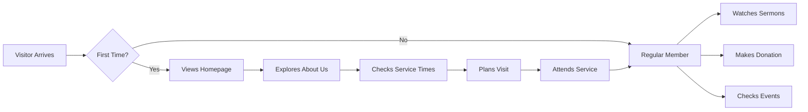

# Windsor Gospel Assembly - Church Website

<div align="center">
  
  
  ### You Belong Here
  
  [](https://reactjs.org/)
  [](https://www.typescriptlang.org/)
  [](https://tailwindcss.com/)
  [](LICENSE)
  
  **A modern, responsive church website built to connect, inspire, and grow our community**
  
  [View Live Site](https://wgachurch.com) | [Report Issue](https://github.com/wgachurch/website/issues) | [Strategic Roadmap](#roadmap)
</div>

---

## 📋 Table of Contents

**For Everyone:**
- [About This Project](#about-this-project)
- [Current Features](#current-features)
- [How It Works](#how-it-works)
- [Future Vision & Roadmap](#roadmap)

**For Developers:**
- [Technical Overview](#technical-overview)
- [Getting Started](#getting-started)
- [Project Structure](#project-structure)
- [Development Guide](#development-guide)
- [Deployment](#deployment)
- [Contributing](#contributing)

---

## 🏛️ About This Project

Windsor Gospel Assembly's digital platform serves as our **"digital front door"** - welcoming newcomers, connecting our community, and extending our ministry beyond Sunday services. This website is integral to our three strategic goals:

1. **🚪 Bring in New People** - Making first-time visitors feel welcome and informed
2. **🏗️ Making History Campaign** - Transparently raising funds for our new church building
3. **🌐 Digital Church Presence** - Extending ministry through online engagement

### Our Mission
To create an accessible, engaging digital experience that reflects God's love and our church's welcoming spirit, while providing practical tools for spiritual growth and community connection.

---

## ✨ Current Features

### For Visitors
- **🏠 Welcoming Homepage** - Dynamic video background with clear service times
- **📍 Service Information** - Sunday Worship (10:30 AM) & Saturday Bible Study (7:00 PM)
- **📺 Media Library** - Full catalog of sermons and worship sessions organized by series
- **💝 Online Giving** - Secure donation platform supporting multiple funds
- **📱 Social Integration** - Direct links to YouTube, Instagram, and Facebook
- **ℹ️ About Section** - Our beliefs, mission, and what makes WGA special

### For Members
- **🎥 Sermon Archives** - Catch up on missed messages anytime
- **💰 Making History Updates** - Track our building campaign progress
- **📧 Contact Information** - Easy access to church contact details
- **🗓️ Service Times** - Always know when to join us

### Mobile Experience
- **📱 Fully Responsive Design** - Optimized for all devices
- **🍔 Mobile Navigation** - Easy-to-use hamburger menu
- **⚡ Fast Loading** - Optimized images and lazy loading

---

## 🔄 How It Works

### User Journey Flow



### Content Management Vision

Currently, content updates require technical knowledge. Our roadmap includes a **Content Management System (CMS)** that will allow church staff to:

1. **Post Announcements** - Add urgent notifications and updates
2. **Upload Sermons** - Publish new messages with titles and descriptions
3. **Manage Events** - Create, edit, and promote church events
4. **Update Service Times** - Modify schedules for special services
5. **Moderate Forms** - Review and respond to prayer requests and inquiries

### Proposed Admin Panel Flow

```
Admin Login → Dashboard
    ├── Content Management
    │   ├── Sermons & Media
    │   ├── Events & Calendar
    │   ├── Announcements
    │   └── Ministry Pages
    ├── Form Submissions
    │   ├── Prayer Requests
    │   ├── Contact Forms
    │   └── Visitor Cards
    ├── Member Directory
    │   ├── Digital Members
    │   └── Newsletter Subscribers
    └── Analytics
        ├── Website Traffic
        ├── Donation Reports
        └── Engagement Metrics
```

---

## 🚀 Roadmap

### Phase 1: Foundation (Current Sprint)
- [x] Core website structure
- [x] Homepage with service information
- [x] Media/sermon library
- [x] Basic giving page
- [ ] Contact form implementation
- [ ] Prayer request system
- [ ] "New Here" visitor section

### Phase 2: Engagement (Next 2 Months)
- [ ] Event management system
- [ ] Ministry showcase pages
- [ ] Newsletter subscription
- [ ] Digital membership registration
- [ ] SMS/Email notifications
- [ ] "Our Impact" transparency page

### Phase 3: Growth (3-6 Months)
- [ ] Content Management System (CMS)
- [ ] Live streaming integration
- [ ] Mobile app development
- [ ] Volunteer portal
- [ ] Online community groups
- [ ] Advanced analytics dashboard

### Future Vision
- [ ] Multi-language support
- [ ] Accessibility features (WCAG compliance)
- [ ] Church management integration
- [ ] Virtual prayer rooms
- [ ] AI-powered chatbot for visitor questions

---

## 🛠️ Technical Overview

### Technology Stack

| Layer | Technology | Purpose |
|-------|------------|---------|
| **Frontend Framework** | React 18.3 | Component-based UI architecture |
| **Language** | TypeScript 5.5 | Type-safe development |
| **Styling** | Tailwind CSS 3.4 | Utility-first responsive design |
| **Routing** | React Router 6.20 | Single-page application navigation |
| **Icons** | Lucide React | Consistent iconography |
| **Build Tool** | Vite 5.4 | Fast development and optimized builds |
| **Package Manager** | npm | Dependency management |

### Architecture

```
┌─────────────────────────────────────────┐
│           React Application             │
├─────────────────────────────────────────┤
│          Component Layer                 │
│  ┌──────────┐  ┌──────────┐  ┌────────┐│
│  │  Pages   │  │Components│  │ Layouts││
│  └──────────┘  └──────────┘  └────────┘│
├─────────────────────────────────────────┤
│           Data Layer                    │
│  ┌──────────┐  ┌──────────┐            │
│  │JSON Data │  │   APIs    │            │
│  └──────────┘  └──────────┘            │
├─────────────────────────────────────────┤
│         Styling Layer                   │
│     Tailwind CSS + Custom CSS           │
└─────────────────────────────────────────┘
```

---

## 🚀 Getting Started

### Prerequisites

- **Node.js** (v18.0.0 or higher)
- **npm** (v9.0.0 or higher)
- **Git** for version control
- **Code Editor** (VS Code recommended)

### Installation

1. **Clone the repository**
```bash
git clone https://github.com/wgachurch/website.git
cd website
```

2. **Install dependencies**
```bash
npm install
```

3. **Start development server**
```bash
npm run dev
```

4. **Open in browser**
```
http://localhost:5173
```

### Available Scripts

| Command | Description |
|---------|-------------|
| `npm run dev` | Start development server with hot reload |
| `npm run build` | Build production-ready application |
| `npm run preview` | Preview production build locally |
| `npm run lint` | Run ESLint for code quality |

---

## 📁 Project Structure

```
WGAWebsite/
├── public/                 # Static assets
│   └── logo-white.png     # Church logo
├── src/
│   ├── components/        # Reusable components
│   │   ├── Header.tsx    # Navigation header
│   │   └── Footer.tsx    # Site footer
│   ├── pages/            # Page components
│   │   ├── Home.tsx      # Landing page
│   │   ├── About.tsx     # About the church
│   │   ├── Giving.tsx    # Donation page
│   │   ├── Media.tsx     # Sermon library
│   │   ├── Mission.tsx   # Mission statement
│   │   ├── Instagram.tsx # Social media gallery
│   │   └── MakingHistory.tsx # Campaign page
│   ├── data/             # Static JSON data
│   │   ├── church.json   # Church information
│   │   ├── youtube.json  # Video content
│   │   └── making-history.json # Campaign data
│   ├── App.tsx           # Main application component
│   ├── main.tsx          # Application entry point
│   └── index.css         # Global styles
├── package.json          # Dependencies and scripts
├── tsconfig.json         # TypeScript configuration
├── tailwind.config.js    # Tailwind CSS configuration
├── vite.config.ts        # Vite build configuration
└── README.md            # This file
```

---

## 💻 Development Guide

### Code Style Guidelines

**TypeScript/React Best Practices:**
```typescript
// ✅ Good: Typed functional component
interface ButtonProps {
  label: string;
  onClick: () => void;
  variant?: 'primary' | 'secondary';
}

const Button: React.FC<ButtonProps> = ({ label, onClick, variant = 'primary' }) => {
  return (
    <button 
      className={`btn btn-${variant}`}
      onClick={onClick}
    >
      {label}
    </button>
  );
};
```

**Tailwind CSS Classes:**
```tsx
// ✅ Good: Organized, readable classes
<div className="flex flex-col md:flex-row gap-4 p-6 bg-navy text-cream rounded-lg">

// ❌ Avoid: Unorganized classes
<div className="p-6 flex bg-navy md:flex-row rounded-lg text-cream flex-col gap-4">
```

### Adding New Features

1. **Create Feature Branch**
```bash
git checkout -b feature/prayer-requests
```

2. **Implement Component**
```typescript
// src/components/PrayerRequestForm.tsx
import React, { useState } from 'react';

const PrayerRequestForm: React.FC = () => {
  // Implementation
};
```

3. **Add Route**
```typescript
// src/App.tsx
<Route path="/prayer" element={<PrayerRequest />} />
```

4. **Test Thoroughly**
- Desktop (Chrome, Firefox, Safari)
- Mobile (iOS Safari, Chrome)
- Tablet (iPad, Android)

5. **Submit Pull Request**
```bash
git add .
git commit -m "feat: add prayer request form"
git push origin feature/prayer-requests
```

### Color Palette

| Color | Hex Code | CSS Variable | Usage |
|-------|----------|--------------|-------|
| Navy | `#1e3a5f` | `bg-navy` | Primary brand color |
| Cream | `#f5f5dc` | `bg-cream` | Background, light text |
| Beige | `#e6d7c3` | `bg-beige` | Accents, cards |
| Charcoal | `#4a4a4a` | `bg-charcoal-gray` | Text, secondary elements |

---

## 🚀 Deployment

### Production Build

1. **Build the application**
```bash
npm run build
```

2. **Test production build**
```bash
npm run preview
```

3. **Deploy to hosting service**

The `dist/` folder contains the production-ready files.

### Recommended Hosting Options

| Service | Best For | Setup Difficulty |
|---------|----------|------------------|
| **Netlify** | Quick deployment, automatic HTTPS | Easy |
| **Vercel** | Next.js compatibility, analytics | Easy |
| **AWS S3 + CloudFront** | Scale, control, cost-effective | Medium |
| **Traditional Hosting** | Existing church hosting | Medium |

### Environment Variables

Create a `.env` file for sensitive configuration:
```env
VITE_API_URL=https://api.wgachurch.com
VITE_PAYPAL_CLIENT_ID=your_paypal_client_id
VITE_GOOGLE_ANALYTICS_ID=GA_MEASUREMENT_ID
```

---

## 🤝 Contributing

We welcome contributions from our church community and beyond! Whether you're fixing a typo or adding a new feature, your help is appreciated.

### How to Contribute

1. **Find an Issue** - Check our [issue tracker](https://github.com/wgachurch/website/issues)
2. **Fork the Repository** - Create your own copy
3. **Make Changes** - Follow our code style guidelines
4. **Test Everything** - Ensure nothing breaks
5. **Submit Pull Request** - Describe your changes clearly

### Contribution Areas

- **🐛 Bug Fixes** - Help us squash bugs
- **✨ New Features** - Implement roadmap items
- **📝 Documentation** - Improve guides and comments
- **🎨 Design** - Enhance UI/UX
- **♿ Accessibility** - Make the site usable for everyone
- **🌍 Translations** - Help reach more communities

### Code of Conduct

As a church community, we strive to:
- Show grace and patience in all interactions
- Provide constructive, encouraging feedback
- Welcome newcomers with open arms
- Glorify God through excellent work

---

## 📞 Support & Contact

### Technical Support
- **GitHub Issues:** [Report bugs or request features](https://github.com/wgachurch/website/issues)
- **Email:** tech@wgachurch.com

### Church Contact
- **Phone:** +1 (226) 724-9319
- **Email:** info@wgachurch.com
- **Address:** 1695 University Ave W., Windsor, ON N9B 1C3

### Service Times
- **Sunday Worship:** 10:30 AM
- **Saturday Bible Study:** 7:00 PM

---

## 📄 License

This project is licensed under the MIT License - see the [LICENSE](LICENSE) file for details.

---

## 🙏 Acknowledgments

- Our church community for continuous feedback and support
- All contributors who help improve this platform
- The open-source community for amazing tools and libraries
- Most importantly, glory to God for enabling this ministry

---

<div align="center">
  
### Built with ❤️ by Windsor Gospel Assembly
  
**"And let us consider how we may spur one another on toward love and good deeds"**  
*Hebrews 10:24*

[Website](https://wgachurch.com) | [YouTube](https://youtube.com/@wgachurch) | [Instagram](https://instagram.com/_w.g.a_) | [Facebook](https://facebook.com/wgachurch)

</div>